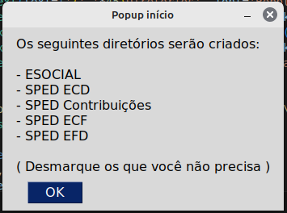
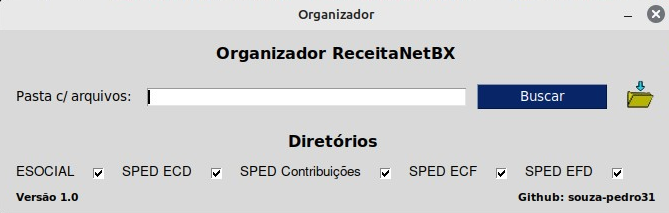

## Bem-vindo(a) ao repositório do OrganizadorReceitaBX
Olá, eu sou Pedro, e este é mais um dos meus projetos pessoais onde compartilho soluções práticas para desafios do dia a dia. Ao navegar pela vasta rede, é possível encontrar inúmeros projetos interessantes, mas muitos deles carecem de aplicabilidade prática em situações reais.

A proposta deste repositório é oferecer soluções para problemas que surgiram no meu cotidiano e que foram resolvidos por meio deste código. Cada projeto reflete uma experiência pessoal e uma abordagem prática para resolver desafios específicos.

## Motivação
Em vez de simplesmente buscar projetos por sua complexidade ou inovação, concentro-me em questões reais que encontrei no meu caminho. Acredito que soluções simples e eficazes são valiosas e podem beneficiar outros desenvolvedores e entusiastas.

A ideia para esse projeto surgiu quando vi o tempo que demandava para organizar os arquivos SPED baixados do programa da Receita Federal. Antes do OrganizadorReceitaBX era necessário que os arquivos fossem baixados e organizados uma categoria por vez, para evitar que se misturassem. Após a implementação do software isso já não é mais necessário.

## Como Usar Este Repositório

Este repositório foi projetado com simplicidade em mente. Seguir estes passos simples permitirá que você aproveite as soluções apresentadas:

1. **Baixe o Script**

 - No diretório principal do projeto, você encontrará o script necessário para a organização dos arquivos. Faça o download do script para o seu ambiente local.

2. **Instale as Dependências:**

 - Antes de executar o script, certifique-se de instalar todas as dependências necessárias e o módulo autoral "organizadorreceitabx.py". Você pode fazer isso executando o seguinte comando no terminal:
```
pip freeze install requirements.txt
```

3. **Execute o Script:**

 - Com as dependências instaladas, agora você pode executar o script. Utilize a interface para apontar para o diretório onde estão localizados os arquivos que você deseja organizar




4. **Interaja com a Interface:**

 - O script iniciará uma interface simples que permitirá que você configure a organização dos arquivos de acordo com suas preferências (podendo escolher quais diretórios serão criados, caso em sua pasta não exista todos os tipos de arquivos). Siga as instruções na interface para personalizar o processo de organização.
 


5. **Aprecie a Organização:**

 - Após a execução do script, seus arquivos devem estar organizados conforme suas especificações. Aprecie a organização recém-criada!

6. **Observações:**
 - O projeto foi criado em ambiente Windows, para que funcione adequadamente em ambiente Unix será necessário fazer alterações no módulo "organizadorreceitabx.py".
Este é um processo simples, mas eficaz, projetado para facilitar a organização de arquivos de forma rápida e intuitiva. Caso encontre algum problema ou tenha sugestões de melhorias, sinta-se à vontade para contribuir ou entrar em contato.

Espero que esta ferramenta torne sua vida um pouco mais fácil!

**Contribuição:**
Se você encontrar maneiras de melhorar ou otimizar as soluções apresentadas, fique à vontade para contribuir. Sua participação é valiosa para tornar esses projetos ainda mais úteis e abrangentes.

Agradeço por explorar este repositório e espero que as soluções apresentadas aqui sejam úteis para você!

Pedro.
